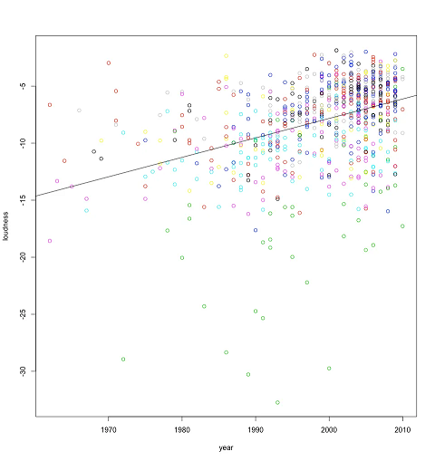

## Introduction

Phrases such as “Alexa, play songs like ‘Girls like you’ on Spotify” and “Playing more of what you like”, have become ubiquitous this decade and the core algorithms powering them are recommender systems. Recommender systems find applications in almost every software product we interact with and are greatly responsible for making them more enjoyable for us.
Music recommendation systems generally operate by analyzing a user's music preferences, both explicit ratings and implicit oftenly heard songs, and mapping another song closest to the preference. For implicit ratings, collaborative filtering on audio properties of the song and other metadata about it are leveraged to plug into a model based on collaborative filtering [1] or through Singular Value Decomposition [2]. On the flip side, some recommendation models also operate via clustering similar songs together and recommending new songs from the cluster [3].
For this project, we will be working on the Million Song dataset [4] which contains 300GB of metadata of 1 million songs, as the name suggests. Some of the features of this dataset include beat frequency, artist tags, energy, danceability, segments_timbre_shape. While we do not know what every feature represents in terms of audio properties, the plenty of features do give us enough playroom to engineer more meaningful features for the model.

## Problem Definition

In this project we aim to build a music recommendation system that analyzes a user’s music preferences and provides meaningful recommendations. Our system will be based on the Million Song dataset which contains metadata for 1 million songs. We will use the Echo Nest Taste Profile Subset [4] to obtain data on user preferences. We will engineer meaningful features from the dataset, and experiment with collaborative filtering and clustering techniques to build the most effective recommendation model.

## Methods

For modeling we will experiment with different techniques under supervised and unsupervised learning. We would start by providing next song recommendations to users based on a few previous songs. For supervised learning, we plan to experiment with classifiers like KNN and MLP to find a candidate set of next songs that would land closest to the given input song. We would use an appropriate distance metric like Euclidean Distance or Cosine Similarity on song representations in the model’s feature space to find a list of next songs. Under the unsupervised paradigm, we will experiment with clustering techniques like K-Means, GMM and DBSCAN to suggest songs belonging to the same cluster.

The second type of recommendation we plan to implement is collaborative filtering. We will experiment with collaborative filtering methods like cosine similarity and SVD with reduced dimensions to create models. These models will be used to recommend songs to a user based on their likes, using the preferences of other users. The recommendations provided by multiple collaborative filtering approaches will be compared to learn the pros and cons of each approach. We also aim to compare the quality of recommendations provided to a user using clustering based models and collaborative filtering models.

## Potential Results and Discussion

We plan on measuring the impact of recommendations using three metrics over a k-fold cross validation [5] set- Precision@k, Recall@k or HitRatio@k, Accuracy@k of the list of recommendations. Furthermore, conducting an EDA on this dataset should help us visualize the intricacies between various genres like their BPM, loudness, etc. [6] 
This project would engender discussion topics like performance of various models in song recommendations, ideal approach of recommending songs from song sets and determining the appropriate distance measures for choosing the closest song from the candidate pool of songs.

## Proposed Timeline

INSERT IMAGE HERE

[Link to Full Gantt Chart](https://drive.google.com/file/d/1kYv0eMd6moiMXjqHtyMAOoOe5MlqGz8l/view?usp=sharing)

## Contribution table

| Name              | Task        |
| ----------------- | ----------- |
| Aditya Salian     | Dataset Search, Results and Discussions, Presentation Recording       |
| Shlok Shah        | Github Page Creation, Introduction/Background, Presentation Recording        |
| Anirudh Mukherjee | Dataset Search, Gantt Chart, Github page creation, Presentation Recording       |
| Vidit Jain        | Problem Definition, Methods, Presentation Recording        |
| Shivam Agarwal    | Problem Definition, Methods, Presentation Recording        |
 
  

## References

[1] K. Yoshii, M. Goto, K. Komatani, T. Ogata and H. G. Okuno, "An Efficient Hybrid Music Recommender System Using an Incrementally Trainable Probabilistic Generative Model," in IEEE Transactions on Audio, Speech, and Language Processing, vol. 16, no. 2, pp. 435-447, Feb. 2008, doi: 10.1109/TASL.2007.911503.
 
[2] Y. Chen, "A music recommendation system based on collaborative filtering and SVD," 2022 IEEE Conference on Telecommunications, Optics and Computer Science (TOCS), Dalian, China, 2022, pp. 1510-1513, doi: 10.1109/TOCS56154.2022.10016210.

[3] P. N, D. Khanwelkar, H. More, N. Soni, J. Rajani and C. Vaswani, "Analysis of Clustering Algorithms for Music Recommendation," 2022 IEEE 7th International conference for Convergence in Technology (I2CT), Mumbai, India, 2022, pp. 1-6, doi: 10.1109/I2CT54291.2022.9824160.

[4] Thierry Bertin-Mahieux, Daniel P.W. Ellis, Brian Whitman, and Paul Lamere. The Million Song Dataset. In Proceedings of the 12th International Society for Music Information Retrieval Conference (ISMIR 2011), 2011.

[5] Schindler A, Mayer R, Rauber A. Facilitating Comprehensive Benchmarking Experiments on the Million Song Dataset. InISMIR 2012 Oct (pp. 469-474).

[6] Cascante J. Song Genre Identification: The Million Song Dataset. Machine Learning Homework. 2017 Sep.

