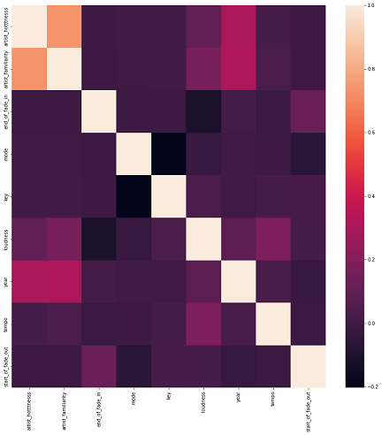
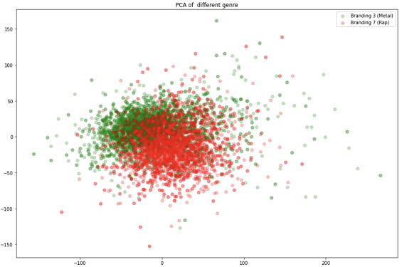

# Beat Buddy
{: .no_toc }

## Table of contents
{: .no_toc .text-delta }

1. TOC
{:toc}

## Introduction

<!-- <iframe src ="GenreDeminationOverYears.html" height = "500" width = "500"></iframe> -->
Phrases such as "Alexa, play songs like 'Girls like you' on Spotify" and "Play today's hit songs'", have become ubiquitous this decade and the core algorithms powering them are recommender and ranking systems. Such systems find applications in almost every music software product we interact with and are greatly responsible for making them more enjoyable for us. 

Simple pattern matching hints that popular songs have similar musical attributes common amongst them. These attributes can be in turn leveraged by systems and artists to predict whether a new song conforms to them and will be a hit or not. [1]
Music recommendation systems generally operate by analyzing a user's music preferences and mapping another song closest to the preference. Some recommendation models operate via collaborative filtering on audio properties of the song [2]. Some recommendation models also operate via clustering similar songs together and recommending new songs from the cluster [3]. 

For this project, we will be working on the Million Song dataset [4] which contains 300GB of metadata of 1 million songs, as the name suggests. Some of the features of this dataset include beat frequency, artist tags, energy, danceability, key, mode and tempo. While we do not know what every feature represents in terms of audio properties, the plenty of features do give us enough playroom to engineer more meaningful features for the model. 

## Problem Definition
 
In this project we aim to build a music system that analyzes a song to predict whether it will be a hit song or not and provide recommendations to other such similar songs. Our system will be based on the Million Song dataset which contains metadata for 1 million songs. We will use the Echo Nest Taste Profile Subset [4] to obtain data on user preferences. 
 
## Data Collection:

### Phase 1 - Obtaining the Data
  
We obtained our data from the Million Song Dataset. It contains metadata and audio features for a million popular music tracks. The dataset contains 54 features in total. It’s important to note that the dataset does not include any audio. The description for each feature in the dataset can be found on this link - [http://millionsongdataset.com/pages/example-track-description/](http://millionsongdataset.com/pages/example-track-description/)
 
Due to its popularity, there are several datasets which are complementary to the million song dataset and provide information like lyrics, song similarity, user ratings etc. We haven’t used these datasets until our mid term evaluation but don’t discount using them by the end of the project for some tangential analysis. The entire dataset is available as an Amazon Public Dataset Snapshot. We attached this to an EC2 instance to obtain the data. 

The data we obtained from the million song dataset was in the form of multiple h5 files. In our initial analysis, we have used 17 gigabytes out of the almost 500 gigabytes of data from the original dataset. This translates to roughly 63,000 song records for our analysis. The dataset also provided a summary file describing each column in the dataset called “subset_msd_summary_file.h5”. We used this file to get the datatype of each column. We read the multiple h5 files, combining them in a single dataframe and then stored this dataframe in the form of a pickle file for ease of use when performing further analysis and training our models.  
 
### Phase 2 - Data Cleaning
  
The dataset has quite a few features which are in the form of lists mostly stored as metadata which was not useful for our analysis. The dataset also had a large number of NaN values (= 107761) which we planned on eliminating. On removing the list-like features we are left with 24 features. We used these records with the remaining features to generate a correlation matrix in order to visualize the most independent features in our dataset and to remove features that are highly correlated as including those while training our models would be unnecessary. The heatmap of this matrix is given below.  
 

  

From the initial heatmap, we can observe that 2 values, namely danceability and energy are 0 throughout the dataset as it required the use of another external API to fill in these values. 
Furthermore, we only wanted to keep those features that would quantitatively describe a song and its associated artist and have only a single numerical value associated with it therefore dropping all non numerical values. Next, we dropped all the records that had null values in them and all the ‘Year’ values that were set to 0. This left us with about 20,000 records and 24 features. We are trying to predict the hotness of a song for this analysis, so we kept the 12 most independent features in order to predict a given song’s popularity score.
  
 
These selected features are:

1. Artist hotness
2. Artist familiarity
3. Tatums start
4. Bars start
5. Beats start
6. End of fade in
7. Mode 
8. Key
9. Loudness
10. Year
11. Tempo
12. Start of fade out

A description of the final dataset:
 

|       | artist_hotttnesss	| artist_familiarity | end_of_fade_in |	mode |	key |	loudness |	year |	tempo |	 start_of_fade_out | song_hotttnesss |
|:------|:-------------------|:-----------------|:-----------------|:-----|:-----|:-----------|:------|:-------|:-------------------|:----------------|
| count	| 19135.000000 | 19135.000000 |	19135.000000 |	19135.00000 |	19135.000000 | 19135.000000 |19135.000000 | 19135.000000 | 19135.000000 | 19135.000000 |
| mean	| 0.431157	   | 0.618173	  | 0.852027	 | 0.66475	    | 5.349360	     | -9.273987    | 1999.781813 |	125.484927 | 236.276356	| 0.487838 |
| std	| 0.094461	   | 0.116110	  | 2.060096	 | 0.47209	    | 3.569214	     | 4.783052	    | 9.692999	  | 34.855468	| 112.343246 | 0.157353 | 
| min	| 0.000000     | 0.000000	  | 0.000000	 | 0.00000	    | 0.000000	     | -50.350000   | 1942.000000  | 	0.000000 | 2.168000 | 0.188104 |
| 25%	| 0.376839	   | 0.546140	  | 0.000000	 | 0.00000	    | 2.000000	     | -11.602500   | 1996.000000	| 99.424500 | 177.035000 | 0.372530 |
| 50%	| 0.421349	   | 0.614099	  | 0.191000	 | 1.00000	    | 6.000000	     | -8.181000    | 2003.000000	| 122.291000 | 220.659000 | 0.487112 |
| 75%	| 0.480112	   | 0.690960	  | 0.432000	 | 1.00000	    | 9.000000	     | -5.873500    | 2007.000000	| 146.581500 | 273.537000 | 0.597493 |
| max	| 1.082503	   | 1.000000	  | 60.389000	 | 1.00000	    | 11.000000      | 2.697000     | 2010.000000	| 269.510000 | 3007.738000 | 1.000000 |

## Methodology

### Exploratory Data Analysis Heuristics and Use of Latent Dirichlet Allocation 

Given features such as artist latitude and longitude for the dataset, we wanted to analyze the spread of artists across the world in the dataset. Furthermore, using this spread, our goal was to analyze the propagation of various genres of music across the world over the time duration specified by our dataset. 

While working with the dataset, we observed that the genre feature in the dataset is very reductive in its tagging of artists which is why we decided to create a soft clustering of this data. To achieve this soft clustering of genre we decided to use the “artist_terms” attribute in the dataset which specifies a list of terms associated with the artist, and the “artist_weight_term_weights” feature which denotes the weights (or more intuitively, the confidence) with the artist has been associated with this particular term. 

We used Latent Dirichlet Allocation to associate artists with terms associated with them in the artist_terms feature. Since LDA allows a set of observations to be explained by unobserved groups for explaining similar looking data points in the dataset, we have described the soft clustering genre of an artist as a mixture of terms and topics attributable to a single generalizable topic (for example “Heavy Metal”). We refer to this soft clustering of genres of these artists as “branding” of an artist.

### Supervised Learning Algorithms
  
For the midpoint report, we focussed on implementing supervised learning algorithms with the goal of predicting the hotness of a song which is a direct indicator which determines how popular a given song is. The ‘song_hotttnesss’ is a continuous feature with values between 0 and 1 that tell us how popular or a hit a particular song is. Using ‘song_hotttnesss’ as an indicator will aid us in recommending different kinds of music to a user while further improving upon the recommendation scheme in the future stages of our project.
  
For this task, we implemented two supervised algorithms in order to analyze how well they are able to predict the song popularity given a certain set of features:

1. Linear Regression
2. Random Forest Regression

To evaluate the performance of these models, we calculated two evaluation scores:
1. Coefficient of determination (R2) score
2. Mean squared error (MSE)

We begin with roughly 63,000 points of data and all the 54 features extracted from the dataset. To make an accurate and impactful model, feature selection is required to be performed since utilizing all features for our prediction task can hamper the model’s capabilities. For this, we referred back to our EDA results and selected 13 independent numerical features to represent the training set.

For both linear regression and our random forest regressor, we split our data into a training set and a test set through a 80:20 split using the sklearn’s train_test_split module. For the random forest regressor, we set hyperparameters as the number of estimators (n_estimators) to 3 and max depth of trees (max_depth) to 10 to provide the best set of performance through some rough estimation. After fitting out models to the dataset, we evaluate the results on the test set to obtain the evaluation scores which have been discussed further in the next section.

We also extract the importance scores of the features on which we trained the model as a sanity check to determine if the given features played an important role in predicting the popularity of a given song. 
  
  
## Potential Results and Discussion

### Plotting Spread of Artists

After cleaning the dataset as specified in the Data Cleaning section, we had a dataframe of 16,158 artists. Using their latitude and longitudinal features, we plotted their location on the folium map as depicted below:

### Plotting the Year Distribution Histogram for Songs
Using the “year” column in our dataset, we plotted a histogram of the song releases. Note that most of the distribution of this data is skewed towards the 1990s. 

### Categorizing Genre of Artists Using Artist Description Terms

The dataset provided us with some genre tags for artists but those tags are very reductive of the versatility of the artists in the dataset. For genre classification of these artists, we wanted a soft clustering approach to group similar artists together. After performing LDA on our dataset, we found the following 10 genre of music: 

We then plotted a histogram to represent the distribution of these genres: 

To explore how the song hotness and artist hotness vary over the various genres, we create a joint distribution plot between the respective variables. 

We observe that song hotness is more evenly distributed than artist hotness over the range of values for all genres and that artist hotness is positively correlated to song hotness over all genres. The contour plot shown above protrudes beyond the bounds of the graph to give a sense of the 3 dimensional plot on a 2 dimensional plane.

### Propagation of Various "Brandings" over the years

Since we now had the brandings of various artists computed, we decided to create an interactive visualization to depict the propagation and popularity over the years. The following depicts the time progression popularity of brandings of 4 out of the 10 genres categorized by us- Metal, Jazz, Soft Rock and Latin Music:
  
  
#### Metal Genre Progression: 

<iframe src ="GenreDeminationOverYears.html" height = "500" width = "800"></iframe>

#### Jazz Genre Progression: 

<iframe src ="JazzMusicOutputMap.html" height = "500" width = "800"></iframe>

#### Soft Rock Genre Progression:

<iframe src ="SoftRockMusicOutputMap.html" height = "500" width = "800"></iframe>

#### Latin Music Genre Progression:

<iframe src ="LatinMusicOutputMap.html" height = "500" width = "800"></iframe>

### PCA on Genre Prediction 
  
We wanted to see the impact of segment_timbre features in distinguishing between genres. Thus, we conducted a PCA on this particular feature. The following were the results on two genres. We compared the results between Metal and Rap genres. As depicted, there is a clear distinction between the two genres.  

Now, we decided to project a TSNE plot of all 10 genres. As we can see, the distinction between the 10 genres is evident.

### Supervised Learning Results on Popularity Prediction 

The performance metrics we calculated for the two models we trained as follows:

| Name              | mse_train        | mse_test | r2_train | r2_test |
| ----------------- | ----------- | ------------- | -------- | --------| 
| Linear Regression | 0.018058 | 0.018972 | 0.2776023 | 0.232158 |
| Random Forest regressor | 0.014008 | 0.017897 | 0.467345 | 0.305548 |

In general, a lower Mean Square Error value indicates a better performance of the model while a higher R2 score is indicative of a better performance.
 
For Linear Regression,
We observe that the difference between mse scores and R2\ score for train and test is not very high; thus we can affirm that the linear regression model is not overfitting. However, the low mse score is not supported by high R2\ scores indicating a poor model. We aim to further improve upon this model by increasing the size of data that we train it on in the next stages.
 

For the Random Forest Regressor,
We observe that there is a difference between the scores of r2_train and r2_test indicating the model has overfit on the training data. This can also be improved upon by increasing the number of samples for training.
 

On observing the features importance scores for each of the 12 features used by us, we obtain non-negative and non-null values for the features, with artist_familiarity and artist_hotness to have the highest importance score amongst the selected features. This would bear an indication towards a hypothesis that an artist’s brand itself plays a big role in determining the kind of popularity a song receives.  
 

Overall, the Random Forest regressor provides us with a higher R2 score thus indicating a better performance as compared to the Linear Regression based model.  We also observe that the number of sample points proves to be less for training an effective mode and perhaps increasing the training size to a hundred thousand samples would potentially yield better results. One of the next steps for our final report will be to train the model on more data from the million song dataset.

## Contribution table

| Name              | Task        |
| ----------------- | ----------- |
| Aditya Salian     | Data Preprocessing and Exploratory Data Analysis       |
| Shlok Shah        | Supervised Learning Models, Website        |
| Anirudh Mukherjee | Supervised Learning Models, Website     |
| Vidit Jain        | Dataset Preparation and Visualizations      |
| Shivam Agarwal    | Data Preprocessing and Exploratory Data Analysis |
 

  

## References

[1] Dimolitsas I, Kantarelis S, Fouka A. SpotHitPy: A Study For ML-Based Song Hit Prediction Using Spotify. arXiv preprint arXiv:2301.07978. 2023 Jan 19.

[2] K. Yoshii, M. Goto, K. Komatani, T. Ogata and H. G. Okuno, "An Efficient Hybrid Music Recommender System Using an Incrementally Trainable Probabilistic Generative Model," in IEEE Transactions on Audio, Speech, and Language Processing, vol. 16, no. 2, pp. 435-447, Feb. 2008, doi: 10.1109/TASL.2007.911503.

[3] P. N, D. Khanwelkar, H. More, N. Soni, J. Rajani and C. Vaswani, "Analysis of Clustering Algorithms for Music Recommendation," 2022 IEEE 7th International conference for Convergence in Technology (I2CT), Mumbai, India, 2022, pp. 1-6, doi: 10.1109/I2CT54291.2022.9824160.

[4] Thierry Bertin-Mahieux, Daniel P.W. Ellis, Brian Whitman, and Paul Lamere. The Million Song Dataset. In Proceedings of the 12th International Society for Music Information Retrieval Conference (ISMIR 2011), 2011.

