# Beat Buddy
{: .no_toc }

## Table of contents
{: .no_toc .text-delta }

1. TOC
{:toc}

## Introduction

Phrases such as “Alexa, play songs like ‘Girls like you’ on Spotify” and “Play today’s hit songs’”, have become ubiquitous this decade and the core algorithms powering them are recommender and ranking systems. Such systems find applications in almost every music software product we interact with and are greatly responsible for making them more enjoyable for us.

Simple pattern matching hints that popular songs have similar musical attributes common amongst them. These attributes can be in turn leveraged by systems and artists to predict whether a new song conforms to them and will be a hit or not. [1] Music recommendation systems generally operate by analyzing a user’s music preferences and mapping another song closest to the preference. Some recommendation models operate via collaborative filtering on audio properties of the song [2]. Some recommendation models also operate via clustering similar songs together and recommending new songs from the cluster [3].

For this project, we will be working on the Million Song dataset [4] which contains 300GB of metadata of 1 million songs, as the name suggests. Some of the features of this dataset include beat frequency, artist tags, energy, danceability, segments_timbre_shape. While we do not know what every feature represents in terms of audio properties, the plenty of features do give us enough playroom to engineer more meaningful features for the model.

## Problem Definition
 
In this project, we aim to build a music system that analyzes a song to predict its potential to be a hit in the market. Additionally, we aim to create a recommendation system that will provide songs similar to a given song. Our system will be trained on the Million Song dataset which contains metadata for 1 million songs. To accomplish these goals, we aim to build and compare both supervised and unsupervised machine learning algorithms

The supervised algorithms will be used to predict whether a song will be a hit or not based on its features. On the other hand, the unsupervised algorithms will cluster similar songs together to provide recommendations when given an input song.

By comparing the performance of these algorithms, we will gain insights into their strengths and weaknesses. Our ultimate objective is to create a music system which is capable of accurately predicting the popularity of songs and providing relevant recommendations to users.

*ML Pipeline*
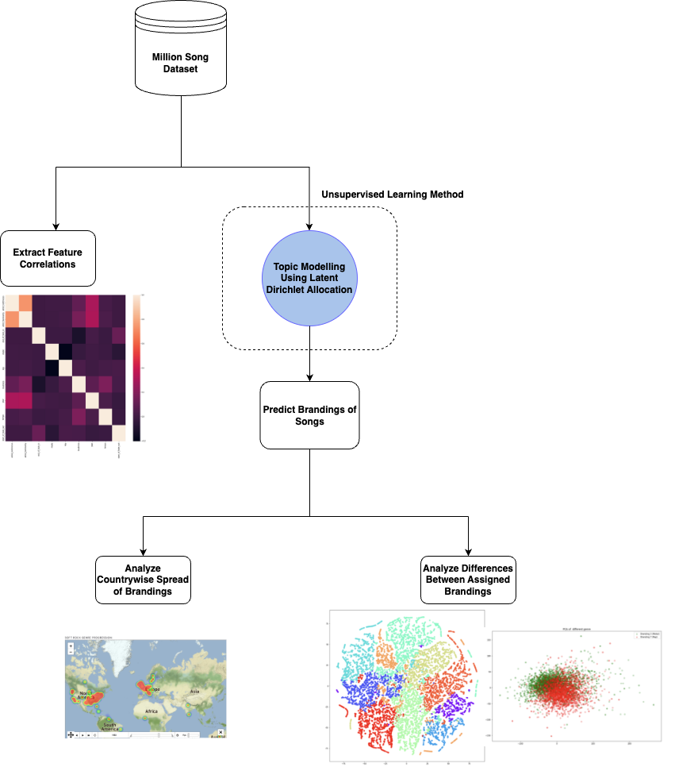
 
## Data Collection:

### Phase 1 - Obtaining the Data
  
We obtained our data from the Million Song Dataset. It contains metadata and audio features for a million popular music tracks. The dataset contains 54 features in total. It’s important to note that the dataset does not include any audio. The description for each feature in the dataset can be found on this link - [http://millionsongdataset.com/pages/example-track-description/] (http://millionsongdataset.com/pages/example-track-description/)

Due to its popularity, there are several datasets which are complementary to the million song dataset and provide information like lyrics, song similarity, user ratings etc. The entire dataset is available as an Amazon Public Dataset Snapshot. We attached this to an EC2 instance to obtain the data.

The data we obtained from the million song dataset was in the form of multiple h5 files. In our analysis, we have used 37 gigabytes out of the almost 500 gigabytes of data from the original dataset. This translates to roughly 137,000 song records for our analysis. The dataset also provided a summary file describing each column in the dataset called “subset_msd_summary_file.h5”. We used this file to get the datatype of each column.

We read the multiple h5 files, combining them in a single dataframe and then stored this dataframe in the form of a pickle file for ease of use when performing further analysis and training our models.

 
### Phase 2 - Data Cleaning
  
The dataset has quite a few features which are in the form of lists mostly stored as metadata which was not useful for our analysis. The dataset also had a large number of NaN values (~ 71000) which we planned on eliminating. On removing the list-like features we are left with 24 features. We used these records with the remaining features to generate a correlation matrix in order to visualize the most independent features in our dataset and to remove features that are highly correlated as including those while training our models would be unnecessary. The correlation matrix for the same is given below.
 
*Correlation Heatmap - 24 Features*     
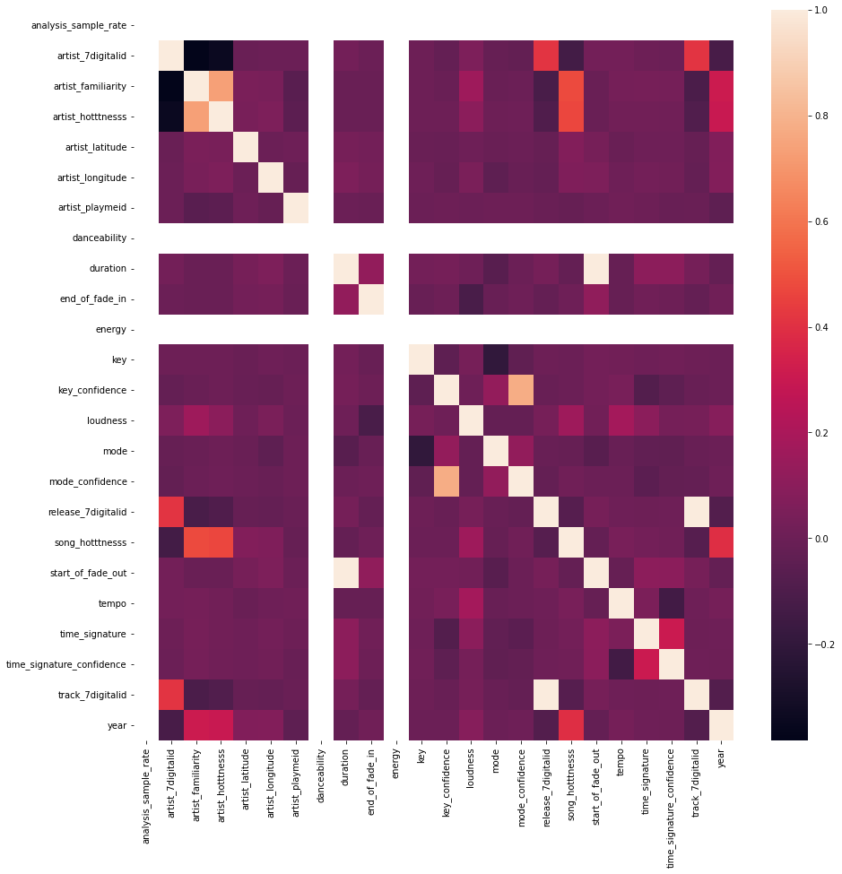
  

From the initial heatmap, we can observe that 2 values, namely danceability and energy are 0 throughout the dataset as it required the use of another external API to fill in these values. 
Furthermore, we only wanted to keep those features that would quantitatively describe a song and its associated artist and have only a single numerical value associated with it therefore dropping all non numerical values. Next, we dropped all the records that had null values in them and all the ‘Year’ values that were set to 0. This left us with about 41636 records and 24 features. We are trying to predict the hotness of a song for this analysis, so we kept the 19 most independent features in order to predict a given song’s popularity score.
  
 
These selected features are:

1. Artist hotness
2. Artist familiarity
3. Tatums start
4. Bars start
5. Beats start
6. End of fade in
7. Mode 
8. Key
9. Loudness
10. Year
11. Tempo
12. Start of fade out
13. Segments timbre Features - X_mean, X_median, X_skew, X_std, X_kurtosis
14. Segments pitches Features - pitches_mean, pitches_median, pitches_skew, pitches_std, pitches_kurtosis

*Correlation Heatmap - 20 Features*   
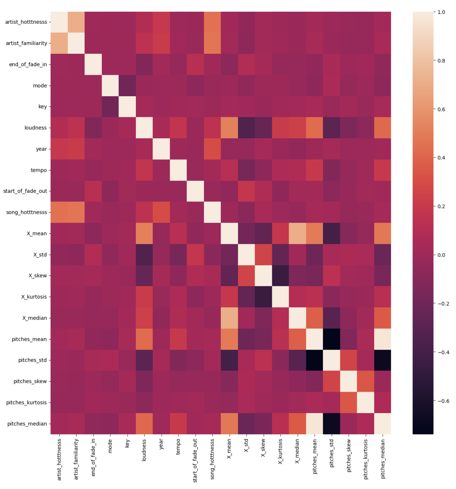  

A description of the final dataset:
 

|       | artist_hotttnesss	| artist_familiarity | end_of_fade_in |	mode |	key |	loudness |	tempo |	start_of_fade_out |	 song_hotttnesss | song_hotttnesss | X_mean | X_std | X_skew | X_kurtosis  | X_median  | pitches_mean | pitches_std | pitches_skew | pitches_kurtosis | pitches_median
|:------|:-------------------|:-----------------|:-----------------|:-----|:-----|:-----------|:------|:-------|:-------------------|:----------------|:-----------|:----------|:--------|:--------|:-----------|:---------|:---------|:----------|:--------|
| count	| 41636 | 41636 |	41636 |	41636 |	41636 | 41636 |41636 | 41636 | 41636 | 41636 | 41636 | 41636 | 41636 | 41636 | 41636 | 41636 | 41636 | 41636 | 41636 | 41636 |
| mean	| 0.3977819626	   | 0.6181969106	  | 0.002465038129	 | 0.6597896051	    | 0.4843208238	     | 0.4843208238    | 0.4648792879 |	0.07853757979 | 0.36835746	| 0.4751042281| 0.2407984316 | 0.3744412722 | 0.4850114606 | 0.4490821627 | 0.3826320243 | 0.2948912395 | 0.4493730946 | 0.1692513138 | 0.2966339424 | 0.2948912395 |
| std	| 0.08841666975	   | 0.1153573361	  | 0.008369685428	 | 0.4737854719	    | 0.3259395724	     | 0.08777459961	    | 0.129530544	  | 0.03668322427	| 0.1927747066 | 0.05445736651 | 0.09972631987 | 0.1882872348 | 0.2837591327 | 0.06825836199 | 0.1034113635 | 0.1177364106 | 0.1128277572 |  0.1315446043 | 0.1140948636 | 0.1034113635 |
| min	| 0     | 0	  | 0	 | 0	    |0	     | 0  | 0  | 	0 | 0 | 0 | 0 | 0 | 0 | 0 | 0 | 0 | 0 | 0 | 0 | 0 |
| 25%	| 0.3478033264	   | 0.5466502677	  | 0	 | 0	    |0.1818181818	     | 0.7232737803   | 0.3676431301	|0.05878758947 | 0.227517312 | 0.446025994 | 0.1705016711 | 0.2244502682 | 0.2414650578 | 0.4090562281 | 0.3073429734 | 0.2105524913 | 0.3790746786 |  0.08409326834 | 0.2119244392 |  0.3676431301 |
| 50%	| 0.3893926759	   | 0.6141846632	  | 0.0005415757061	 | 1	    | 0.4545454545	     | 0.7857544892    | 0.4544822085	| 0.07340760524 | 0.3669161626 |0.4817005671 | 0.2286738727 | 0.3722896761 | 0.4355646871 | 0.4495738318 |  0.3821303454  |  0.2807086801  |  0.4545968561  | 0.1289239188  |  0.291322314  | 0.4545454545 |
| 75%	| 0.4437374053	   | 0.6909601791	  |  0.001200399761	 | 1	    | 0.8181818182	     | 0.8280588994    | 0.5427201217	| 0.09097859403 | 0.503313226 | 0.5105092977 | 0.2951802499 | 0.5110938294 |  0.7358142505 | 0.4907564945 | 0.454795958 |  0.3647833546  |  0.5245239663  |  0.2084099811  | 0.3736717828 | 0.8181818182 |
| max	| 1	   | 1	  | 1	 | 1	    | 1     | 1     | 1	| 1 | 1 | 1 | 1 | 1 | 1 | 1 | 1 | 1 | 1 | 1 | 1 | 1 |

## Methodology

### Exploratory Data Analysis Heuristics and Use of Latent Dirichlet Allocation 

Given features such as artist latitude and longitude for the dataset, we wanted to analyze the spread of artists across the world in the dataset. Furthermore, using this spread, our goal was to analyze the propagation of various genres of music across the world over the time duration specified by our dataset. 

While working with the dataset, we observed that the genre feature in the dataset is very reductive in its tagging of artists which is why we decided to create a soft clustering of this data. To achieve this soft clustering of genre we decided to use the “artist_terms” attribute in the dataset which specifies a list of terms associated with the artist, and the “artist_weight_term_weights” feature which denotes the weights (or more intuitively, the confidence) with the artist has been associated with this particular term. 

We used Latent Dirichlet Allocation to associate artists with terms associated with them in the artist_terms feature. Since LDA allows a set of observations to be explained by unobserved groups for explaining similar looking data points in the dataset, we have described the soft clustering genre of an artist as a mixture of terms and topics attributable to a single generalizable topic (for example “Heavy Metal”). We refer to this soft clustering of genres of these artists as “branding” of an artist.

### Supervised Learning Algorithms
  
We focussed on implementing supervised learning algorithms with the goal of predicting the hotness of a song which is a direct indicator which determines how popular a given song is. The ‘song_hotttnesss’ is a continuous feature with values between 0 and 1 that tell us how popular or a hit a particular song is. Using ‘song_hotttnesss’ as an indicator will aid us in recommending different kinds of music to a user.
  
For this task, we implemented five supervised algorithms in order to analyze how well they are able to predict the song popularity given a certain set of features:
1. Linear Regression
2. Random Forest Regression
3. Support Vector Machine Classifier
4. Gradient Boosting Classifier
5. Multi Layer Perceptron (MLP) Classifier

To evaluate the performance of these models, we calculated two evaluation scores:
1. Coefficient of determination (R2) score
2. Mean squared error (MSE)
3. Accuracy
4. Precision, Recall and F1 scores

We begin with roughly 63,000 points of data and all the 54 features extracted from the dataset. To make an accurate and impactful model, feature selection is required to be performed since utilizing all features for our prediction task can hamper the model’s capabilities. For this, we referred back to our EDA results and selected 19 independent numerical features to represent the training set. For the classification models, we bin the data on the song hotness scores in intervals of 0.25. Since the hotness score for most songs fall into the range of 0.25 to 0.75, the resulting dataset for classification is highly imbalanced. 

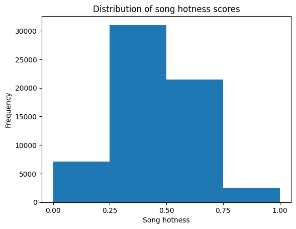

For all models, we split our data into a training set and a test set through a 80:20 split using the sklearn’s train_test_split module. For the random forest regressor, we set hyperparameters as the number of estimators (n_estimators) to 3 and max depth of trees (max_depth) to 10 to provide the best set of performance through some rough estimation. For the SVM classifier, we use a RBF kernel with a regularization parameter of 2. For the Gradient Boosting classifier we used a learning rate of 0.5 and set the number of estimators to 300. For the MLP classifier we used a three hidden layer architecture with a learning rate of 0.01. The network was trained for 100 epochs using the Adam optimizer and L2 regularization. After fitting out models to the dataset, we evaluate the results on the test set to obtain the evaluation scores which have been discussed further in the next section.

We also extract the importance scores of the features on which we trained the model as a sanity check to determine if the given features played an important role in predicting the popularity of a given song. 

### Unsupervised Learning Algorithms

We took on the challenge of providing song recommendations to the user through an unsupervised machine learning approach. While this is generally not implemented in the real world, we wanted to understand why that was the case through this project.

Our approach to this challenge was based on the simple intuition that similar songs will have similar attributes and should be clustered together in an n-dimensional space. Given one song that is liked by a user, we should be able to predict the cluster it would belong to and return k songs from the cluster which will have similar attributes, as recommendations to the user.

The same approach was followed while implementing two popular clustering algorithms: K-means and DBSCAN. We use the same set of features for both these algorithms in order for us to have an apples-to-apples comparison of both. The 10 features selected by us for this task were: ['artist_hotttnesss', 'artist_familiarity', 'end_of_fade_in', 'mode', 'key', 'loudness', 'year', 'tempo', 'start_of_fade_out', 'song_hotttnesss']
We selected these features based on our understanding of their capability to uniquely identify different musical attributes of songs.

We begin with ~63,000 data points before cleaning and pre-processing, which we then filter down to ~41,000 data points of clean and pre-processed data.
K-means being a simpler to tune model, was trained first. Since it depends on the hyperparameter k , or number of centers, we followed the ‘elbow method’ approach to find the ideal number of clusters. The results of these are discussed in the following sections.

Once we found an ideal number of clusters to group our data into, we trained our model and then asked for a user input song name to recommend similar songs to. We also calculated the silhouette score.

As explained in class, we leveraged our fine tuned K-means model and its hyperparameters to tune our DBSCAN model. We set the epsilon param of the DBSCAN algorithm to be the same value as the number of clusters identified by our KMeans algorithm and we worked on fine tuning the optimal values of min_number_points param which identifies how dense a cluster should be in the very least. 

Once the model was trained, we followed a similar approach of calculating the silhouette score and recommending similar songs from the cluster to which a user preferred song belongs to.

## Potential Results and Discussion

### Plotting Spread of Artists

After cleaning the dataset as specified in the Data Cleaning section, we had a dataframe of 16,158 artists. Using their latitude and longitudinal features, we plotted their location on the folium map as depicted below:
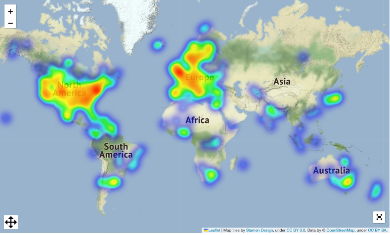

### Plotting the Year Distribution Histogram for Songs
Using the “year” column in our dataset, we plotted a histogram of the song releases. Note that most of the distribution of this data is skewed towards the 1990s. 
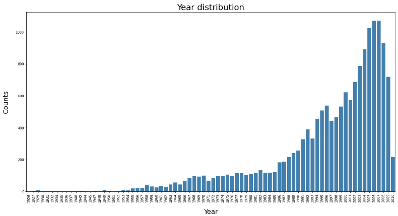

### Categorizing Genre of Artists Using Artist Description Terms

The dataset provided us with some genre tags for artists but those tags are very reductive of the versatility of the artists in the dataset. For genre classification of these artists, we wanted a soft clustering approach to group similar artists together. As mentioned in the Methodology section, we used LDA on the artist_terms and artist_term_weights features to bin the artists into 10 different brandings. After performing LDA on our dataset, we found the following 10 genres of music as our result: 

*Genre Categorization*   
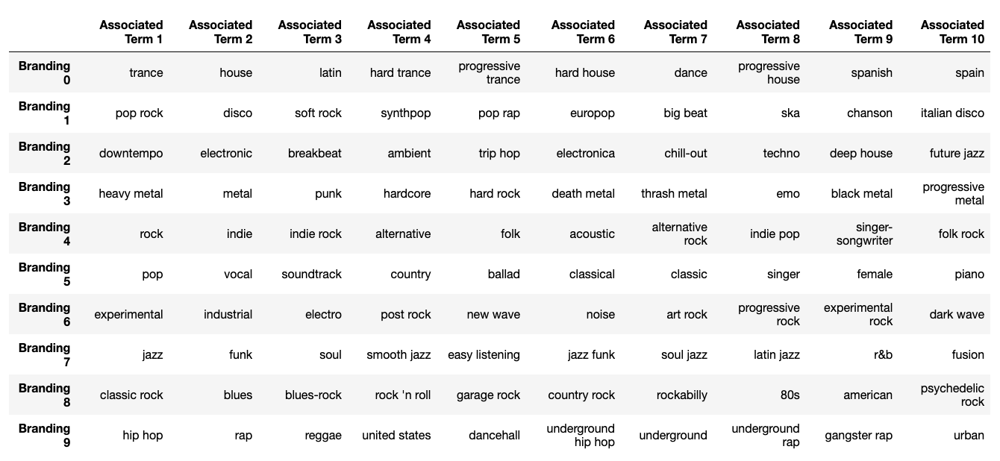
We then plotted a histogram to represent the distribution of these genres: 

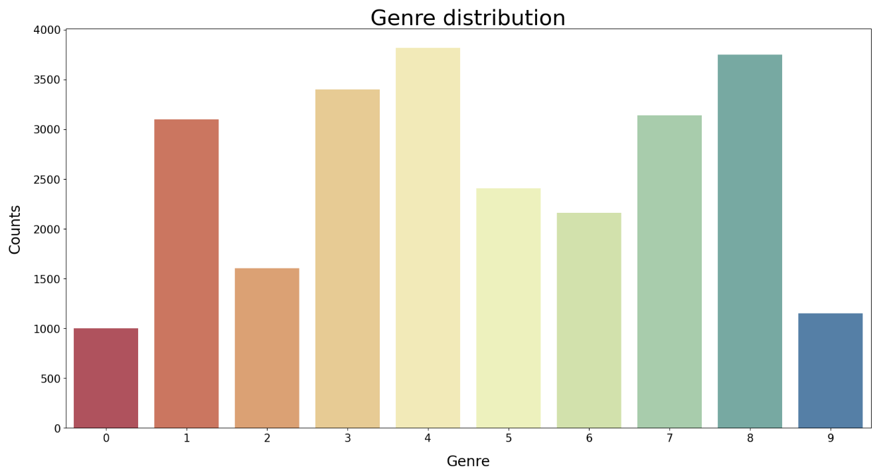
To explore how the song hotness and artist hotness vary over the various genres, we create a joint distribution plot between the respective variables. 
  

*Contour Plot Artist Hotness vs Song Hotness*   
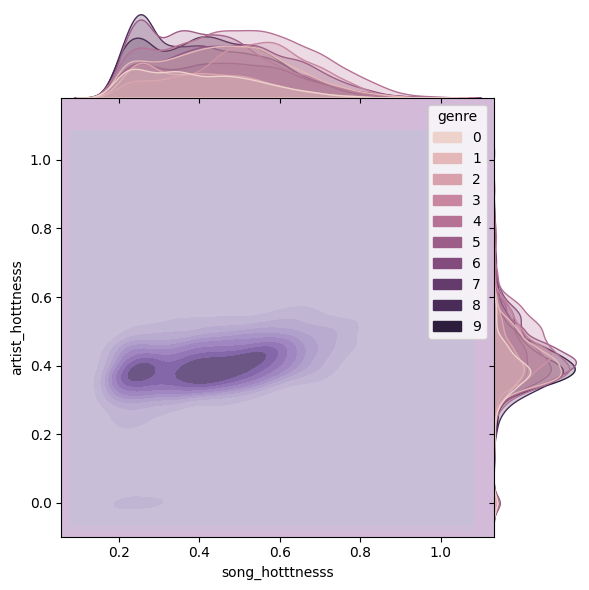

We observe that song hotness is more evenly distributed than artist hotness over the range of values for all genres and that artist hotness is positively correlated to song hotness over all genres. The contour plot shown above protrudes beyond the bounds of the graph to give a sense of the 3 dimensional plot on a 2 dimensional plane.

### Propagation of Various "Brandings" over the years

Since we now had the brandings of various artists computed, we decided to create an interactive visualization to depict the propagation and popularity over the years. The following depicts the time progression popularity of brandings of 4 out of the 10 genres categorized by us- Metal, Jazz, Soft Rock and Latin Music:
  
  
#### Metal Genre Progression: 

<iframe src ="GenreDeminationOverYears.html" height = "500" width = "800"></iframe>

#### Jazz Genre Progression: 

<iframe src ="JazzMusicOutputMap.html" height = "500" width = "800"></iframe>

#### Soft Rock Genre Progression:

<iframe src ="SoftRockMusicOutputMap.html" height = "500" width = "800"></iframe>

#### Latin Music Genre Progression:

<iframe src ="LatinMusicOutputMap.html" height = "500" width = "800"></iframe>

### PCA on Genre Prediction 
  
We wanted to see the impact of segment_timbre features in distinguishing between genres. Thus, we conducted a PCA on this particular feature. The following were the results on two genres. We compared the results between Metal and Rap genres. As depicted, there is a clear distinction between the two genres.  

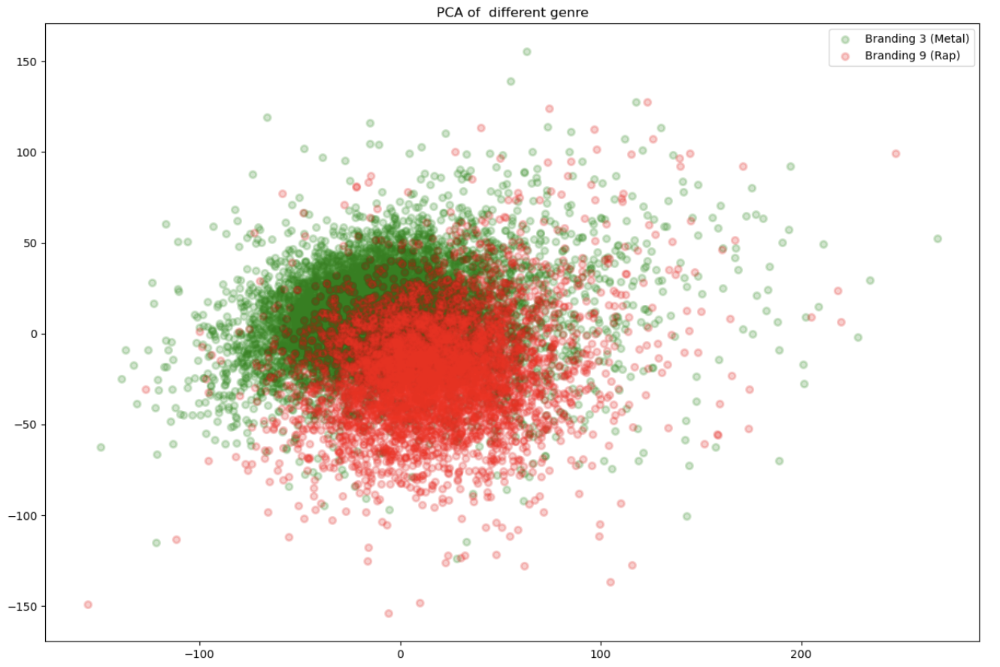

Now, we decided to project a t-distributed stochastic neighbor embedding (t-SNE) to visualize all of the 10 genres. As we can see, the distinction between the 10 genres is evident.  

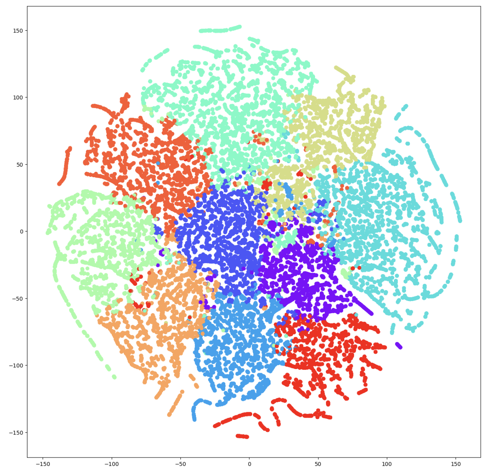

### Supervised Learning Results on Popularity Prediction 

The performance metrics we calculated for the two models we trained as follows:

| Name              | mse_train        | mse_test | r2_train | r2_test |
| ----------------- | ----------- | ------------- | -------- | --------| 
| Linear Regression | 0.018058 | 0.018972 | 0.2776023 | 0.232158 |
| Random Forest regressor | 0.014008 | 0.017897 | 0.467345 | 0.305548 |

In general, a lower Mean Square Error value indicates a better performance of the model while a higher R2 score is indicative of a better performance.

| Model                        | Precision       | Recall       | F1       | Accuracy       |
|------------------------------|-----------------|--------------|----------|----------------|
| SVM Classifier               |  0.5396         |   0.5726     |  0.5196  |    0.5726      |
| Gradient Boosting Classifier |  0.5570         |   0.5834     | 0.5552   |    0.5834      |
| MLP Classifier               |  0.5357         |   0.5765     | 0.5256   |    0.5765      |

 
For Linear Regression,
We observe that the difference between mse scores and R2\ score for train and test is not very high; thus we can affirm that the linear regression model is not overfitting. However, the low mse score is not supported by high R2\ scores indicating a poor model. We aim to further improve upon this model by increasing the size of data that we train it on in the next stages.
 

For the Random Forest Regressor,
We observe that there is a difference between the scores of r2_train and r2_test indicating the model has overfit on the training data. This can also be improved upon by increasing the number of samples for training.
 

*Feature Importance Score for Random Forest Regressor*
  
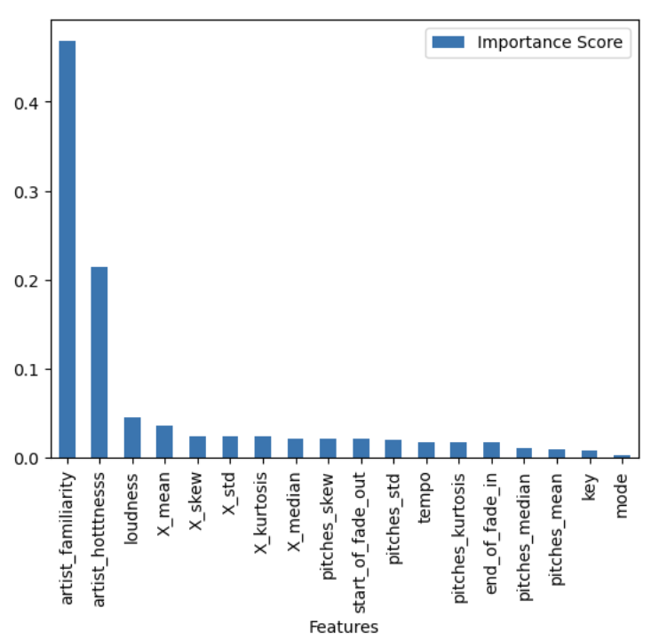

For the SVM Classifier, we experiment with a variety of kernels including RBF, poly and linear. As the data is highly complex and imbalanced, RBF kernel seems to perform the best in terms of the above metrics.
 

For Gradient Boosting Classifier, a grid search is performed for the learning rate and number of estimators. Increasing the estimators to a large number hurts performance and leads to overfitting. A perfect balance is obtained at 300 estimators with a learning rate of 0.5.
 

For the MLP classifier, we vary the number of hidden layers and neurons in each layer along with the learning rate. We discover that a high learning rate of 0.01 and three hidden layers having 100, 1000 and 100 neurons respectively gives the best performance.  
 

On observing the features importance scores for each of the 12 features used by us, we obtain non-negative and non-null values for the features, with artist_familiarity and artist_hotness to have the highest importance score amongst the selected features. This would bear an indication towards a hypothesis that an artist’s brand itself plays a big role in determining the kind of popularity a song receives.  
 

The Random Forest regressor provides us with a higher R2 score when compared to a linear regression model thus indicating a better performance as compared to the Linear Regression based model.  We also observe that the number of sample points proves to be less for training an effective mode and perhaps increasing the training size to a hundred thousand samples would potentially yield better results.
 

For all the classification models, we make sure that the models don’t overfit using careful hyperparamter tuning and optimal regularization. High data imbalance makes the classification problem challenging. Since there is a high imbalance in the data, F1 score would be a better metric to measure performance than accuracy. Out of all the models we tried, we find that Gradient Boosting classifier performs the best according to the F1 score. We feel that is the case due to the fact that it is an ensemble based classifier and so its generalization capabilities are higher than the other two standalone models when trained on imbalanced data.

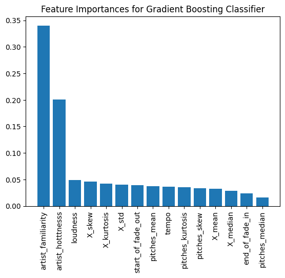

### Unsupervised Learning Results to Group Similar Songs

The elbow method analysis for K-means was run over a range of K values from 1 to 40 for which we saw the elbow form over cluster number 10 after which it became stable and flatlined. This can be seen in the graph below

*K-Means Elbow Method*

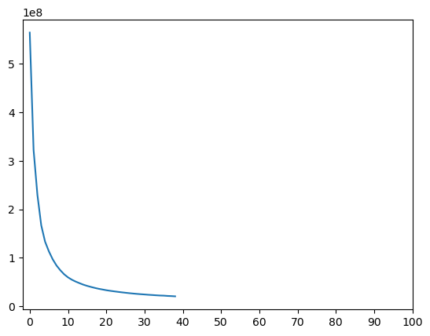

This is an acceptable number and also conforms to our findings from our EDA. We observed the data to be broadly split between 10 genres. Hence, 10 clusters identified through elbow method seems to be an intuitive result, corresponding to the different genres identified.

The performance metric we calculated for both K-means and DBSCAN was the silhouette score which we obtained as follows:

|Algorithm      | Silhouette score   |
|---------------|--------------------|
|K-means        |      0.3018        |
|DBScan         |      0.1604        |

A few examples of recommended songs suggested to the user via K-Means were as follows.

*K-Means Recommendation*

We follow a similar design to display the suggested songs for user using the DBSCAN approach:

*DBScan Recommendation*

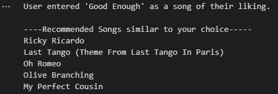

## Conclusions

### Exploratory Data Analysis

Through this project, we had a very real experience of working with dirty data and the need for feature engineering.  Having more impactful features can compensate for a slight decrease in the number of data points required to gain better model performance. EDA on our dataset helped us understand the different features in the data and their characteristics. We were also able to dive deep into the different genres present in the data to extrapolate insights straight through simple analysis. Through this process we were able to successfully identify common features between songs which are more descriptive than the subjective nature of their genre

### Supervised Learning

Through our study of the Million Song Dataset, we were able to successfully classify songs which have the potential to be hot. Furthermore, we have also extracted features from this dataset which contributed significantly towards the decision making of these models. In the supervised learning domain, we have successfully provided a framework for songwriters to monitor the various features of their songs in a way which can prove to be a “hot song” for themselves.

### Unsupervised Learning

In the unsupervised learning domain, we made two significant contributions- firstly, we used Latent Dirichlet Allocation to group songs on the basis of the terms associated with them to group them into identical brandings; and secondly, we  employed the clustering prowess of the K-Means and DBSCAN algorithms to recommend similar songs to a particular song based on their features. Thus, we have successfully provided a framework and pipeline for extracting songs of a similar branding, and recommend similar songs to a particular song.

## Contribution table

| Name              | Task        |
| ----------------- | ----------- |
| Aditya Salian     | Supervised Learning - Random Forest Regressor, Exploratory Data Analysis       |
| Shlok Shah        | Supervised Learning - MLP Classifier, Unsupervised Learning - DBScan, Website        |
| Anirudh Mukherjee | Supervised Learning - Linear Regression Classifier, Unsupervised Learning - K-Means, Website     |
| Vidit Jain        | Supervised Learning - Gradient Boosting Classifier, SVM, Visualizations  |
| Shivam Agarwal    | Unsupervised Learning - K-Means, DBScan, Data Preprocessing and Exploratory Data Analysis |
 

  

## References

[1] Dimolitsas I, Kantarelis S, Fouka A. SpotHitPy: A Study For ML-Based Song Hit Prediction Using Spotify. arXiv preprint arXiv:2301.07978. 2023 Jan 19.

[2] K. Yoshii, M. Goto, K. Komatani, T. Ogata and H. G. Okuno, "An Efficient Hybrid Music Recommender System Using an Incrementally Trainable Probabilistic Generative Model," in IEEE Transactions on Audio, Speech, and Language Processing, vol. 16, no. 2, pp. 435-447, Feb. 2008, doi: 10.1109/TASL.2007.911503.

[3] P. N, D. Khanwelkar, H. More, N. Soni, J. Rajani and C. Vaswani, "Analysis of Clustering Algorithms for Music Recommendation," 2022 IEEE 7th International conference for Convergence in Technology (I2CT), Mumbai, India, 2022, pp. 1-6, doi: 10.1109/I2CT54291.2022.9824160.

[4] Thierry Bertin-Mahieux, Daniel P.W. Ellis, Brian Whitman, and Paul Lamere. The Million Song Dataset. In Proceedings of the 12th International Society for Music Information Retrieval Conference (ISMIR 2011), 2011.

